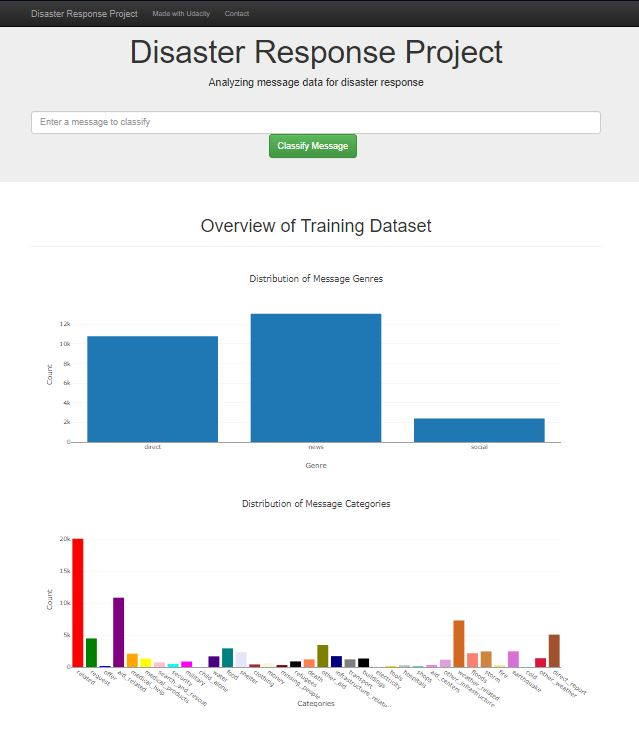
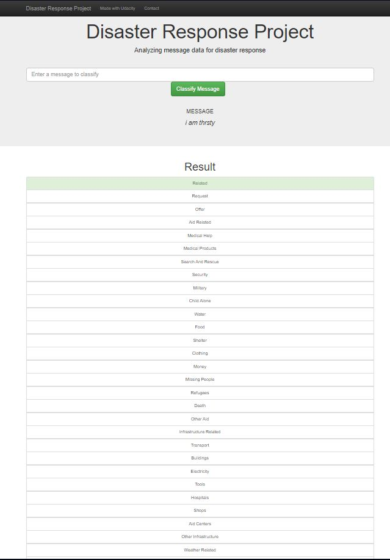

# Udacity-disaster_response

<b>Table of Contents</b>
1. Description
2. Dependencies
3. Program execution
4. Screenshots

<b> 1. Description </b> 
This project is a part of Udacity course. The aim of this project was to create disaster response clasificator.

In data/process_data.py I joined csv files and create database.  
In models/train_classifier.py I perform feature engineering, create ML pipeline and built model.   
In app/run.py fronted has been created and model shared using Flask.   
  

<b> 2. Dependencies </b> 
Needed libraries:  
NumPy, SciPy, Pandas, Sciki-Learn, NLTK, SQLalchemy, Pickle, Flask, Plotly  
 

<b> 3. Program execution </b> 
a) clone git repository:  
<pre>
https://github.com/malowana/Udacity-disaster_response.git  
</pre>
 
b) You can run again command below to create db and train model again or skip this step and use uploaded model: 
 -To run ETL pipeline to clean data and store the processed data in the database 
  <pre>
python data/process_data.py data/disaster_messages.csv data/disaster_categories.csv data/disaster_response_db.db
</pre>
 
  -To run the ML pipeline that loads data from DB, trains classifier and saves the classifier as a pickle file python  
  <pre>
models/train_classifier.py data/disaster_response_db.db models/classifier.pkl
</pre>

c) Run your web app:    
<pre>
python run.py
</pre>

d) Go to http://0.0.0.0:3001/ and play with the app  
 
<b> 4. Screenshots </b> 
a) main page where is plot of distribution of genres and categories and place where you can put your message  
   
b) after clicking "Classiby message" button you will be forwarded to the next page where your message will be classified to the proper category  
   
